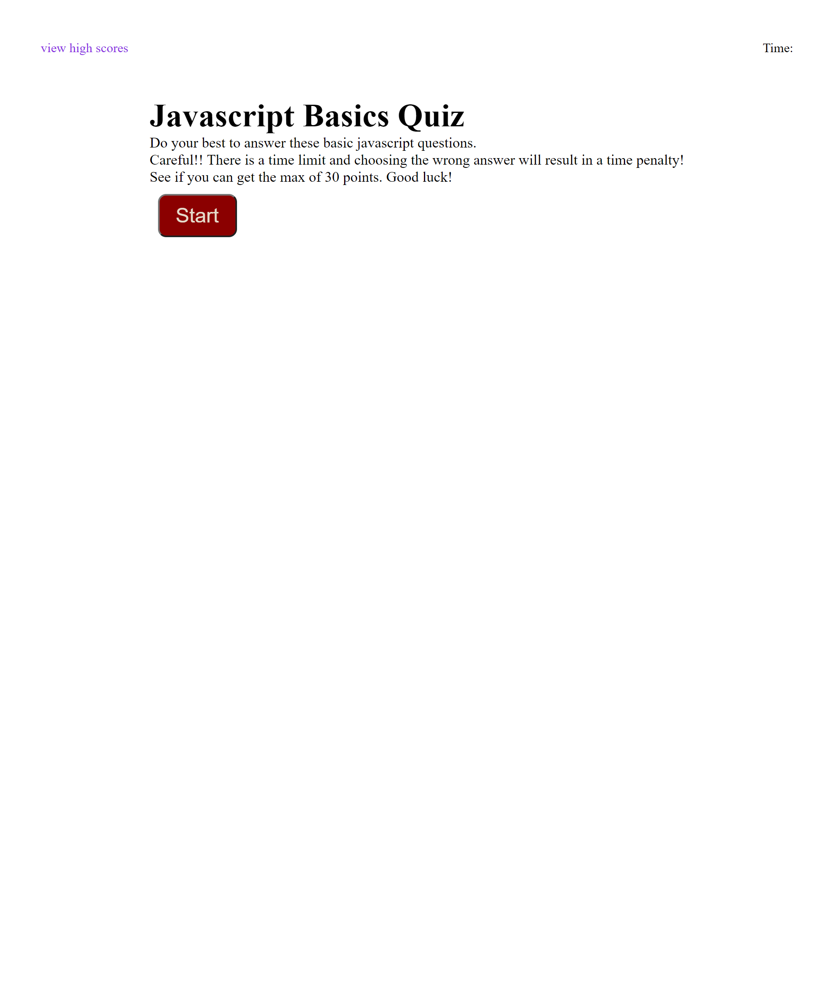

# javascript-basics-quiz

#Summary
A javascript basics quiz to test your knowledge. It is timed and wrong answers will result in a time penalty in
a loss of 5 seconds. Each correct answer will give you 5 points. See if you can get the max score of 30 points. There are only 6
questions to answer and have 75 seconds to answer them. Your score will be saved and able to view. Below is a link and a screenshot of the javascript quiz. 

https://austin-espinal.github.io/javascript-basics-quiz/

